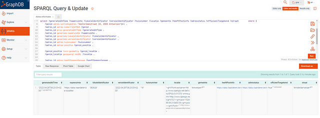

# LDES2Service

```note
***Please Note!***

_The purpose of the quick start try-out is solely to create _[Pagination fragmentation](https://github.com/Informatievlaanderen/VSDS-LDESServer4J/tree/main/ldes-fragmentisers/ldes-fragmentisers-pagination)_ for the self-generated data type to _[LDES format](https://semiceu.github.io/LinkedDataEventStreams/)_. To support other fragments, data types, or other features, e.g., retention, caching, etc., please consult _[LDES Server Manual](https://github.com/Informatievlaanderen/VSDS-LDESServer4J)_ for the configurations._

[Vlaamse Smart Data Space](https://www.vlaanderen.be/digitaal-vlaanderen/onze-oplossingen/vlaamse-smart-data-space)_ projects also provide methods for transforming data to *[LDES format](https://semiceu.github.io/LinkedDataEventStreams/)_, e.g. from _[NGSI-V2](https://vloca-kennishub.vlaanderen.be/NGSI-v2)* to *[NGSI-LD](https://en.wikipedia.org/wiki/NGSI-LD)_, from NGSI to _[OSLO](https://www.vlaanderen.be/digitaal-vlaanderen/onze-oplossingen/oslo)_ Model, from _[NGSI-V2](https://vloca-kennishub.vlaanderen.be/NGSI-v2)_ to _[LDES (LinkedDataEventStreams)](https://semiceu.github.io/LinkedDataEventStreams/).

```

```tip
Having trouble implementing this example? Please post your issue on the [VSDS Tech docs repo](https://github.com/Informatievlaanderen/VSDS-Tech-Docs/issues).

```

In this short example below, we show you how the components of the VSDS can be used to link multiple data streams across domains and systems using LDES. The whole story can be read here: [Real-Time Data Linkage via Linked Data Event Streams](https://pub.towardsai.net/real-time-data-linkage-via-linked-data-event-streams-e1aab3090b40)

## Before starting

1.  [Docker](https://docker.com/) has been installed on your device.
2.  Local Ports 8443 and 7200 are accessible.

## Start your LDES workbench

1.  Create a local [docker-compose.yml](https://github.com/samuvack/ldes-grar/blob/main/docker-compose.yml) file with the following content, or you could use the current good-to-go [GetStarted GRAR project](https://github.com/samuvack/ldes-grar):

```yaml
version: ‘3’
volumes:
  nifi-database-repository:
  nifi-flowfile-repository:
  nifi-content-repository:
  nifi-provenance-repository:
  nifi-state:
  nifi-logs:
  nifi-nars:
  nifi-conf:
networks:
  front-tier:
    driver: bridge
  back-tier:
    driver: bridge
services:
  nifi:
    image: ghcr.io/informatievlaanderen/ldes-workbench-nifi:20230214T123440 #20221109T103745
    container_name: nifi-graph
    restart: unless-stopped
    ports:
      # HTTPS
      - 8443:8443/tcp
    volumes:
      - ./nifi-extensions:/opt/nifi/nifi-current/extensions
    environment:
      - NIFI_UI_PORT=8443
      - SINGLE_USER_CREDENTIALS_USERNAME=admin
      - SINGLE_USER_CREDENTIALS_PASSWORD=admin123456789
      - NIFI_WORKFLOW_LISTEN_PORT=9005
      - NIFI_JVM_HEAP_INIT=8g
      - NIFI_JVM_HEAP_MAX=8g
  graphdb:
    image: ontotext/graphdb:10.0.2
    container_name: graphdb3
    ports:
      # HTTP
      - 7200:7200
```

To begin, the command for launching GraphDb and Apache NiFi within a docker container is as follows:

```source-shell
docker compose up --build
```

Apache Nifi runs on port 8443:8443/tcp :[https://localhost:8443](https://localhost:8443/)\
GraphDB runs on port 7200 :7200/tcp : [http://localhost:7200](http://localhost:7200/)

A data flow can be built up by dragging in building blocks in the graphical user interface of Apache NiFi. This docker container contains all the components out the latest version of the LDES workbench (e.g., latest LDES Client, LDES server, etc.). Every data stream can be transformed into a Linked Data Event Stream with a conversion data flow.

## Starting from a published [LDES](https://semiceu.github.io/LinkedDataEventStreams/)

In this example, we start from published LDES

```turtle
@prefix conceptscheme: <https://data.vlaanderen.be/id/conceptscheme/> .
@prefix generiek:      <https://data.vlaanderen.be/ns/generiek#> .
@prefix geosparql:     <http://www.opengis.net/ont/geosparql#> .
@prefix ldes:          <https://w3id.org/ldes#> .
@prefix locn:          <https://www.w3.org/ns/locn#> .
@prefix prov:          <http://www.w3.org/ns/prov#> .
@prefix rdf:           <http://www.w3.org/1999/02/22-rdf-syntax-ns#> .
@prefix relation:      <http://www.iana.org/assignments/relation/> .
@prefix terms:         <http://purl.org/dc/terms/> .
@prefix tree:          <https://w3id.org/tree#> .
https://data.vlaanderen.be/id/adres/1658513
        relation:self  "https://api.basisregisters.staging-vlaanderen.be/v2/adressen/1658513" .
[ https://data.vlaanderen.be/ns/gebouw#bestaatUit
          <https://data.vlaanderen.be/id/gebouweenheid/17631816/2022-06-27T16:23:49+02:00> ;
  generiek:lokaleIdentificator  "17631524"] .
[ https://data.vlaanderen.be/ns/gebouw#bestaatUit
<https://data.vlaanderen.be/id/gebouweenheid/6311633/2022-06-27T16:23:48+02:00> ;  generiek:lokaleIdentificator  "6310652"] .
https://data.vlaanderen.be/id/gebouweenheid/14539518/2022-06-27T16:23:32+02:00
   rdf:type                      <https://data.vlaanderen.be/ns/gebouw#Gebouweenheid> ;
        terms:isVersionOf             <https://data.vlaanderen.be/id/gebouweenheid/14539518> ;        prov:generatedAtTime          "2022-06-27T16:23:32+02:00"^^<http://www.w3.org/2001/XMLSchema#dateTime> ;
<https://data.vlaanderen.be/ns/gebouw#Gebouweenheid.adres>                <https://data.vlaanderen.be/id/adres/5162364> ;        <https://data.vlaanderen.be/ns/gebouw#Gebouweenheid.geometrie>
                [ conceptscheme:geometriemethode  conceptscheme:aangeduidDoorBeheerder ;                  locn:geometry                   [ geosparql:asGML                                    "<gml:Point srsName=\"http://www.opengis.net/def/crs/EPSG/0/31370\" xmlns:gml=\"http://www.opengis.net/gml/3.2\"><gml:pos>200647.71 210393.46</gml:pos></gml:Point>"^^geosparql:gmlLiteral ]                ] ;        <https://data.vlaanderen.be/ns/gebouw#Gebouweenheid.status>
                conceptscheme:gerealiseerd ;       <https://data.vlaanderen.be/ns/gebouw#functie>                conceptscheme:nietGekend ;
        generiek:lokaleIdentificator  "14539518" ;        generiek:naamruimte           "https://data.vlaanderen.be/id/gebouweenheid" ;        generiek:versieIdentificator  "2022-06-27T16:23:32+02:00" .
<https://data.vlaanderen.be/id/adres/2213034>        relation:self  "https://api.basisregisters.staging-vlaanderen.be/v2/adressen/2213034" .
```

## Consuming an LDES

For this purpose, the three Linked Data Event streams are stored in a [GraphDB](https://graphdb.ontotext.com/) to facilitate efficient and effective data consumption. GraphDB supports complex semantic queries and inference, making discovering meaningful relationships between different data sources possible.


1. Start Apache NiFi on localhost:8433

2. Import data flow by importing [Apache NiFi configuration file](https://raw.githubusercontent.com/samuvack/ldes-grar/main/NiFi_Flow.json). See [this site for more info](https://www.alasdairb.com/posts/importing-individual-flow-definitions-in-nifi/)

3. Add [LDES endpoint](https://onboarding1.smartdataspace.beta-vlaanderen.be/building-units/by-page) in the LDES client

4. Start Apache NiFi data flow


5. Open GraphDB on localhost:7200/sparql

6. Run a semantic query with SPARQL



Below you find an example of a SPARQL query. This query returns triples with information about the parcel LDES.

```turtle
PREFIX adres: <https://data.vlaanderen.be/id/adres/>
PREFIX gebouw: <https://data.vlaanderen.be/id/?gebouweenheid/>
PREFIX gebouweenheid: <https://data.vlaanderen.be/ns/gebouw#>
PREFIX prov: <http://www.w3.org/ns/prov#>
PREFIX generiek: <https://data.vlaanderen.be/ns/generiek#>
PREFIX rdf: <http://www.w3.org/1999/02/22-rdf-syntax-ns#>
construct {
?gebouweenheid prov:generatedAtTime ?generatedAtTime .
?gebouweenheid rdf:type ?type .?gebouweenheid gebouweenheid:Gebouweenheid.geometrie ?geometrie .
?gebouweenheid gebouweenheid:Gebouweenheid.status ?status .
?gebouweenheid gebouweenheid:functie ?functie .
?gebouweenheid generiek:lokaleIdentificator ?lokaleIdentificator .
?gebouweenheid generiek:naamruimte ?naamruimte .
?gebouweenheid generiek:versieIdentificator ?versieIdentificator .
} where {
	?gebouweenheid <https://data.vlaanderen.be/ns/gebouw#Gebouweenheid.adres> <https://data.vlaanderen.be/id/adres/1864311> .
    OPTIONAL{
    ?gebouweenheid prov:generatedAtTime ?generatedAtTime .
	?gebouweenheid rdf:type ?type .
	?gebouweenheid gebouweenheid:Gebouweenheid.geometrie ?geometrie .
	?gebouweenheid gebouweenheid:Gebouweenheid.status ?status .
	?gebouweenheid gebouweenheid:functie ?functie .
	?gebouweenheid generiek:lokaleIdentificator ?lokaleIdentificator .
	?gebouweenheid generiek:naamruimte ?naamruimte .
	?gebouweenheid generiek:versieIdentificator ?versieIdentificator .
}}
```

This SPARQL query returns multiple triples with information about building units. These triples can then be converted into an RDF file.

The RDF file should be as follow:

```turtle
@prefix ns1: <https://data.vlaanderen.be/ns/generiek#> .
@prefix ns2: <https://data.vlaanderen.be/ns/gebouw#> .
@prefix ns3: <http://www.w3.org/ns/prov#> .
@prefix xsd: <http://www.w3.org/2001/XMLSchema#> .
<https://data.vlaanderen.be/id/gebouweenheid/14635685> a ns2:Gebouweenheid ;
    ns3:generatedAtTime "2022-06-27T20:51:02+02:00"^^xsd:dateTime ;    ns2:Gebouweenheid.geometrie [ ] ;    ns2:Gebouweenheid.status <https://data.vlaanderen.be/id/conceptscheme/gerealiseerd> ;
ns2:functie <https://data.vlaanderen.be/id/conceptscheme/nietGekend> ;    ns1:lokaleIdentificator "14635685" ;
ns1:naamruimte "https://data.vlaanderen.be/id/gebouweenheid" ;    ns1:versieIdentificator "2022-06-27T20:51:02+02:00" .
```
