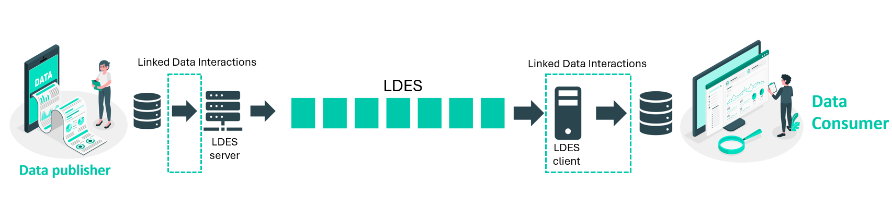

# VSDS Technical Documentation

Linked Data Event Streams (LDES) apply - as the term implies - the concept of linked data to data streams. LDES is a technical standard that allows data to be exchanged between silos sustainably and cost-effectively using domain-specific ontology for fast and slowly changing data streams.

A wealth of information describes how to publish and consume LDES. Here you can find the basic concepts of LDES and 

Are you familiar with these basic concepts of LDES? If so, it's time to start publishing your own LDES or to read and write an already published LDES to your own database. Elaborated examples can be found under 'Onboarding LDES - examples'. 

### Learn by doing

Based on a few use cases, we try to teach you in a light-hearted way how to publish or consume an LDES. In these tech docs we do not go into depth about the different possible parameters, but we show a working configuration for the proposed use case. Detailed information about the technical parameters or configuration options can be found under sections of the building blocks individually.

<a href="https://github.com/Informatievlaanderen/VSDS-Onboarding-Example">
<button style="background-color: #fafbfc; color: #666666; padding: 10px 20px; width: 200px; border: 0.3px solid rgb(0, 200, 171); border-radius: 10px; cursor: pointer;">
        Tutorials (Learn by doing)
    </button>
</a>

### Building Blocks

Would you like more detailed information about the individual open source building blocks? A complete hatch or section is dedicated to each individual building block. The purpose of these sections is to really understand what different parameters you can use to get the perfect configuration of your building block.

<a href="https://informatievlaanderen.github.io/VSDS-Linked-Data-Interactions/">
<button style="background-color: #fafbfc; color: #666666; padding: 10px 20px; width: 200px; border: 0.3px solid rgb(0, 200, 171); border-radius: 10px; cursor: pointer;">
    Linked Data Interactions
</button></a>

<a href="https://informatievlaanderen.github.io/VSDS-LDESServer4J/">
<button style="background-color: #fafbfc; color: #666666; padding: 10px 20px; width: 200px; border: 0.3px solid rgb(0, 200, 171); border-radius: 10px; cursor: pointer;">
        LDES Server
    </button></a>

<a href="https://informatievlaanderen.github.io/VSDS-Linked-Data-Interactions/ldio/ldio-inputs/ldio-ldes-client">
<button style="background-color: #fafbfc; color: #666666; padding: 10px 20px; width: 200px; border: 0.3px solid rgb(0, 200, 171); border-radius: 10px; cursor: pointer;">
        LDES Client
    </button></a>

### OSLO mapping

To publish an LDES, it is recommended to do so based and mapped on a semantic standard. Within the Flanders Smart Data Space, the OSLO semantic standards are used.

To help convert your own source data into an OSLO compliant dataset, we list various OSLO mappings to support you with this.

<a href="https://informatievlaanderen.github.io/OSLO-mapping/">
<button style="background-color: #fafbfc; color: #666666; padding: 10px 20px; width: 200px; border: 0.3px solid rgb(0, 200, 171); border-radius: 10px; cursor: pointer;">
        OSLO mapping documentation
    </button>
</a>

